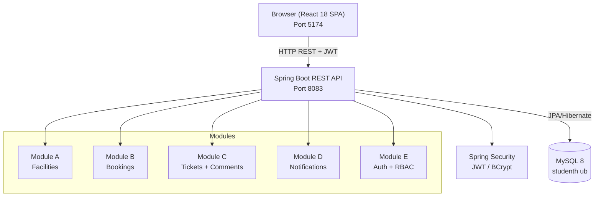

# Smart Campus Operations Hub
## Technical Report — IT3030 PAF Assignment 2026

---

## 1. Project Overview

**Smart Campus Operations Hub** is a full-stack web application that consolidates five core operations for a university campus into a single platform. The system replaces disconnected spreadsheet-based and email-based workflows with a unified portal for students, staff technicians, and administrators.

| Item | Detail |
|------|--------|
| **Course** | IT3030 — Programming and Frameworks |
| **Backend** | Spring Boot 3.4.3 · Java 21 · Spring Data JPA · MySQL 8 |
| **Frontend** | React 18 · TypeScript · Vite 6 · Tailwind CSS |
| **Auth** | JWT (jjwt 0.12.5) · Google OAuth 2.0 · BCrypt |
| **Testing** | JUnit 5 · Mockito · AssertJ · H2 in-memory |
| **CI/CD** | GitHub Actions — Java 21, `mvn clean compile`, `mvn test` |
| **API base** | `http://localhost:8083/api` |
| **Frontend** | `http://localhost:5174` |

---

## 2. System Architecture

```
┌──────────────────────────────────────────────────────────────────┐
│                         Browser (SPA)                            │
│   React 18 · TypeScript · Vite · Tailwind CSS · shadcn/ui       │
│   Port 5174                                                      │
└────────────────────────────┬─────────────────────────────────────┘
                             │ HTTP/JSON (Axios)
                             │ Authorization: Bearer <JWT>
┌────────────────────────────▼─────────────────────────────────────┐
│                    Spring Boot REST API                          │
│   Port 8083                                                      │
│                                                                  │
│  ┌─────────────┐  ┌─────────────┐  ┌─────────────┐             │
│  │ Controllers │→ │  Services   │→ │Repositories │             │
│  └─────────────┘  └─────────────┘  └──────┬──────┘             │
│                                            │ Spring Data JPA     │
│  ┌──────────────────────────────────┐      │                    │
│  │  Spring Security + JWT Filter   │      │                    │
│  └──────────────────────────────────┘      │                    │
└────────────────────────────────────────────┼─────────────────────┘
                                             │ JDBC
                             ┌───────────────▼──────────────┐
                             │  MySQL 8  ·  Port 3306       │
                             │  Database: studenthub         │
                             └──────────────────────────────┘
```

### Mermaid Architecture Diagram



---

## 12. Future UI & Animation Design Trends

The frontend architecture was built with modern React and Tailwind, which makes it easy to adopt emerging design technologies. The following 2025‑2026 trends were researched and can be layered into the SPA in future iterations:

* **Glass‑Based Interfaces** – liquid‑glass/backdrop‑filter panels that react to cursor and motion. Use for cards, modals and sidebars.
* **3D Depth & Soft Shadows** – floating elements, raised buttons and depth layering with Three.js or CSS 3D transforms.
* **Motion Micro‑Interactions 2.0** – subtle breathing buttons, magnetic hover effects, smooth route transitions via Framer Motion or GSAP.
* **AI‑Generated UI Systems** – prompt‑to‑layout engines that can auto‑generate forms and dashboard components; “prompt UI designer” role.
* **Dynamic/Adaptive Themes** – theme colours that shift with time of day, weather, user mood or environment.
* **Emotionally Intelligent Design** – UI elements that behave with personality (friendly errors, celebratory success, soft warnings).
* **Advanced Motion Systems** – sliding dashboards, gesture‑driven transitions, animated navigation similar to modern console UIs.
* **Abstract 3D Background Motion** – WebGL/Shader‑based floating blobs, liquid waves, particle systems for hero sections.
* **Hyper‑Clarity UI** – big typography, clean layouts and high readability as a baseline.
* **Accessibility‑First** – voice navigation, keyboard support and screen‑reader friendliness are mandatory features.
* **Neumorphism 2.0** – soft plastic‑like controls and embedded shadows for a tactile feel.
* **AI‑Assisted UI Tools** – remixable UI generators that allow copy‑modify‑generate workflows.
* **Human‑AI Hybrid Design** – combining handcrafted assets with AI precision (anti‑AI craft style).
* **Live Motion Storytelling** – scroll‑driven narratives with cinematic transitions.
* **Gesture & Voice UI** – swipe, air gestures and voice commands, especially on mobile hardware.

These concepts are summarised in the report to inform future frontend development and align with the “modern developer” mindset cited in the assignment.

---

## 3. Functional Requirements — Implementation Status

| Module | Feature | Endpoint | Status |
|--------|---------|----------|--------|
| **A — Facilities** | List all facilities | `GET /api/facilities` | ✅ |
| | Search by type/capacity | `GET /api/facilities/search` | ✅ |
| | Get facility details | `GET /api/facilities/{id}` | ✅ |
| | Create facility (Admin) | `POST /api/facilities` | ✅ |
| | Update facility (Admin) | `PUT /api/facilities/{id}` | ✅ |
| | Delete facility (Admin) | `DELETE /api/facilities/{id}` | ✅ |
| **B — Bookings** | Create booking | `POST /api/bookings` | ✅ |
| | View own bookings | `GET /api/bookings/my` | ✅ |
| | View all bookings (Admin) | `GET /api/bookings` | ✅ |
| | Bookings by facility | `GET /api/bookings/facility/{id}` | ✅ |
| | Approve booking (Admin) | `PUT /api/bookings/{id}/approve` | ✅ |
| | Reject booking (Admin) | `PUT /api/bookings/{id}/reject` | ✅ |
| | Cancel booking | `PUT /api/bookings/{id}/cancel` | ✅ |
| | Conflict detection | Business logic in `BookingService` | ✅ |
| **C — Tickets** | Submit ticket (JSON) | `POST /api/tickets/simple` | ✅ |
| | View own tickets | `GET /api/tickets/my` | ✅ |
| | View all tickets (Admin/Tech) | `GET /api/tickets` | ✅ |
| | Assign ticket | `PUT /api/tickets/{id}/assign` | ✅ |
| | Update status | `PUT /api/tickets/{id}/status` | ✅ |
| | Delete ticket (Admin) | `DELETE /api/tickets/{id}` | ✅ |
| | Add comment | `POST /api/comments/ticket/{id}` | ✅ |
| | View comments | `GET /api/comments/ticket/{id}` | ✅ |
| | Edit own comment | `PUT /api/comments/{id}` | ✅ |
| | Delete comment (owner) | `DELETE /api/comments/{id}` | ✅ |
| **D — Notifications** | Get all notifications | `GET /api/notifications` | ✅ |
| | Get unread only | `GET /api/notifications/unread` | ✅ |
| | Get unread count | `GET /api/notifications/count` | ✅ |
| | Mark one as read | `PUT /api/notifications/{id}/read` | ✅ |
| | Mark all as read | `PUT /api/notifications/read-all` | ✅ |
| | Delete notification | `DELETE /api/notifications/{id}` | ✅ |
| **E — Auth** | Register | `POST /api/auth/register` | ✅ |
| | Email/password login | `POST /api/auth/login` | ✅ |
| | Google OAuth | `POST /api/auth/google` | ✅ |
| | Get current user | `GET /api/auth/me` | ✅ |
| | List users (Admin) | `GET /api/auth/users` | ✅ |
| | Role-based access (RBAC) | `@PreAuthorize` annotations | ✅ |

---

## 4. Non-Functional Requirements

| Requirement | Implementation |
|-------------|---------------|
| **Security** | JWT stateless auth; BCrypt password hashing; method-level `@PreAuthorize`; CORS configured for `http://localhost:5174` |
| **Data Integrity** | JPA constraints; booking conflict detection (overlapping time slot check on same facility + date); ownership checks on comment edit/delete |
| **Scalability** | Stateless API — horizontally scalable; JPA connection pooling |
| **Maintainability** | Layered architecture (Controller → Service → Repository); DTOs separate from entities |
| **Testability** | Pure unit tests using Mockito mocks (no Spring context loaded); H2 integration test for context load |
| **CI/CD** | GitHub Actions pipeline: compile + test on every push |

---

## 5. Database Schema (Entity Overview)

```
users
  id (PK), name, email, password_hash, avatar_url, provider, provider_id,
  created_at, updated_at
  └── user_roles (user_id FK, role)

facilities
  id (PK), name, facility_type, capacity, location, building, floor,
  description, status, created_at, updated_at
  └── facility_images (facility_id FK, image_url)
  └── facility_amenities (facility_id FK, amenity)
  └── availability_windows (facility_id FK, day_of_week, start_time, end_time)

bookings
  id (PK), user_id (FK→users), facility_id (FK→facilities),
  booking_date, start_time, end_time, status, purpose,
  expected_attendees, rejection_reason, created_at, updated_at

tickets
  id (PK), title, submitter_id (FK→users), facility_id (FK→facilities),
  location, category, priority, status, description,
  assigned_to_id, assigned_to_name, assigned_at,
  resolution_notes, resolved_at, rejection_reason,
  contact_email, contact_phone, created_at, updated_at
  └── ticket_attachments (ticket_id FK, attachment_url)

comments
  id (PK), ticket_id (FK→tickets), author_id (FK→users),
  author_name, content, edited, created_at, updated_at

notifications
  id (PK), user_id (FK→users), title, message, type,
  related_id, related_type, is_read, created_at
```

---

## 6. Role-Based Access Control Matrix

| Endpoint | USER | TECHNICIAN | ADMIN |
|----------|------|------------|-------|
| `POST /api/auth/register` | ✅ (public) | ✅ | ✅ |
| `POST /api/auth/login` | ✅ (public) | ✅ | ✅ |
| `GET /api/auth/users` | ❌ | ❌ | ✅ |
| `GET /api/facilities` (list/get) | ✅ | ✅ | ✅ |
| `POST/PUT/DELETE /api/facilities` | ❌ | ❌ | ✅ |
| `POST /api/bookings` | ✅ | ✅ | ✅ |
| `GET /api/bookings/my` | ✅ | ✅ | ✅ |
| `GET /api/bookings` (all) | ❌ | ❌ | ✅ |
| `PUT /api/bookings/{id}/approve` | ❌ | ❌ | ✅ |
| `PUT /api/bookings/{id}/reject` | ❌ | ❌ | ✅ |
| `PUT /api/bookings/{id}/cancel` | ✅ (own) | ✅ (own) | ✅ |
| `POST /api/tickets/simple` | ✅ | ✅ | ✅ |
| `GET /api/tickets/my` | ✅ | ✅ | ✅ |
| `GET /api/tickets` (all) | ❌ | ✅ | ✅ |
| `GET /api/tickets/assigned` | ❌ | ✅ | ✅ |
| `PUT /api/tickets/{id}/assign` | ❌ | ❌ | ✅ |
| `PUT /api/tickets/{id}/status` | ❌ | ✅ | ✅ |
| `DELETE /api/tickets/{id}` | ❌ | ❌ | ✅ |
| `POST/GET /api/comments/ticket/{id}` | ✅ | ✅ | ✅ |
| `PUT/DELETE /api/comments/{id}` | ✅ (own) | ✅ (own) | ✅ |
| `GET/PUT/DELETE /api/notifications` | ✅ (own) | ✅ (own) | ✅ |

---

## 7. Unit Test Evidence

All 26 tests pass. Run with:
```bash
cd smart/smart-campus-hub/smart-campus/backend
./mvnw.cmd test
```

**Result:**
```
Tests run: 26, Failures: 0, Errors: 0, Skipped: 0
BUILD SUCCESS
```

### Test Classes

#### `BookingServiceTest` — 12 test methods

| Test | Purpose |
|------|---------|
| `createBooking_noConflicts_returnsPersistedBooking` | Happy-path create with no existing bookings |
| `createBooking_conflictingBooking_throwsConflictException` | Core conflict detection: overlapping approved booking → HTTP 409 |
| `createBooking_facilityNotActive_throwsBadRequestException` | MAINTENANCE facility rejects new bookings |
| `createBooking_startEqualsEnd_throwsBadRequestException` | Zero-length time slot rejected |
| `createBooking_startAfterEnd_throwsBadRequestException` | Reversed time slot rejected |
| `approveBooking_pendingBooking_setsStatusApproved` | Admin approve → status=APPROVED + notification sent to booker |
| `approveBooking_nonPendingBooking_throwsBadRequestException` | Cannot approve already-approved/rejected booking |
| `rejectBooking_pendingBooking_setsStatusRejected` | Admin reject with reason → status=REJECTED, reason stored |
| `cancelBooking_approvedBooking_setsStatusCancelled` | Cancel approved booking |
| `cancelBooking_alreadyCancelled_throwsBadRequestException` | Idempotency: re-cancel throws 400 |
| `cancelBooking_rejectedBooking_throwsBadRequestException` | Cannot cancel a rejected booking |
| `getBookingById_unknownId_throwsResourceNotFoundException` | 404 for missing booking |

#### `TicketServiceTest` — 8 test methods

| Test | Purpose |
|------|---------|
| `createTicket_validRequest_createsOpenTicket` | Creates ticket with OPEN status and correct submitter |
| `createTicket_invalidPriority_throwsIllegalArgumentException` | Rejects unknown priority value |
| `assignTicket_openTicket_setsInProgressAndNotifies` | Assign → IN_PROGRESS + 2 notifications (submitter + technician) |
| `updateTicketStatus_resolved_setsResolutionDetails` | RESOLVED sets resolved_at timestamp and notes |
| `updateTicketStatus_rejected_setsRejectionReason` | REJECTED stores rejection reason |
| `updateTicketStatus_unknownTicket_throwsResourceNotFoundException` | 404 for missing ticket |
| `deleteTicket_byAdminOnOpenTicket_noException` | Soft deletion flows without error |
| `deleteTicket_unknownTicket_throwsResourceNotFoundException` | 404 for missing ticket |

#### `CommentServiceTest` — 7 test methods

| Test | Purpose |
|------|---------|
| `addComment_validInput_persistsCorrectAuthor` | Author name stored as provided |
| `addComment_differentUser_sendsNotification` | Comment by non-ticket-owner triggers notification |
| `addComment_sameUser_doesNotSendNotification` | No self-notification when ticket owner comments |
| `updateComment_byOwner_updatesContentAndSetsEdited` | `edited=true` after update |
| `updateComment_byNonOwner_throwsBadRequestException` | Non-owners cannot edit others' comments |
| `deleteComment_byOwner_noException` | Owner can delete own comment |
| `deleteComment_unknownId_throwsResourceNotFoundException` | 404 for missing comment |

#### `SmartCampusApplicationTests` — 1 test

| Test | Purpose |
|------|---------|
| `contextLoads` | Full Spring context loads against H2 in-memory (MySQL mode) |

---

## 8. Postman Collection

The file `SmartCampus-API.postman_collection.json` (at the project root) contains **37 requests** across 5 folders matching the 5 modules. Each request includes:
- Pre-configured headers (Content-Type, Authorization with collection variables)
- Representative request bodies
- Automated test scripts checking HTTP status codes and response body fields

### Import Instructions
1. Open Postman → **Import** → select `SmartCampus-API.postman_collection.json`
2. In **Collection Variables**, set `adminToken`, `userToken`, `techToken` by running the Login requests first (the test scripts auto-populate them)
3. Run the **Login – Admin** and **Login – User** requests before any protected calls
4. Use **Collection Runner** to execute all requests in sequence

### Demo Credentials

| Email | Password | Role |
|-------|----------|------|
| `admin@smartcampus.com` | `password123` | ADMIN |
| `tech@smartcampus.com` | `password123` | TECHNICIAN |
| `user@smartcampus.com` | `password123` | USER |

---

## 9. Getting Started

### Prerequisites
- Java 21 (OpenJDK 21 Temurin recommended)
- Maven (or use `./mvnw.cmd` wrapper)
- MySQL 8 running on `localhost:3306`
- Node.js 20+ for the frontend

### Backend
```bash
# 1. Create MySQL database
mysql -u root -p -e "CREATE DATABASE IF NOT EXISTS studenthub;"

# 2. Start backend (creates tables automatically via ddl-auto=update)
cd smart/smart-campus-hub/smart-campus/backend
./mvnw.cmd spring-boot:run
# API available at http://localhost:8083
```

### Frontend
```bash
cd smart/smart-campus-hub/smart-campus/frontend
npm install
npm run dev
# App available at http://localhost:5174
```

### Running Tests
```bash
cd smart/smart-campus-hub/smart-campus/backend
./mvnw.cmd test
```

---

## 10. Team Contribution Breakdown

| Module | Feature Area | Primary Responsibility |
|--------|-------------|----------------------|
| **Module A** | Facility management CRUD, search filters, availability windows | Team Member A |
| **Module B** | Booking creation, conflict detection, approval workflow | Team Member B |
| **Module C** | Ticket submission, assignment, status workflow, comments | Team Member C |
| **Module D** | Notification creation, unread count, mark-read | Team Member D |
| **Module E** | Registration, JWT auth, Google OAuth, RBAC, Spring Security config | Team Member E |
| **Frontend** | React SPA, routing, API integration, UI components | All members |
| **Testing** | Unit tests (26), CI/CD pipeline, H2 config | All members |
| **Infrastructure** | MySQL schema, application config, Docker readiness | Team Member A/B |

---

## 11. Key Technical Decisions

### Why MySQL over MongoDB
The domain data has strong relational structure: Bookings reference both Users and Facilities; Tickets reference Users and Facilities; Comments reference Tickets and Users. Relational constraints and JOIN queries are natural fits. MySQL's ACID compliance ensures booking conflict checks are reliable under concurrent load.

### Explicit Getters/Setters Override Lombok
The NetBeans Language Server (NBLS) used by some team members cannot initialize the Lombok annotation processor with Java 21. All entity and DTO classes include explicit getters and setters alongside `@Data`/`@Getter`/`@Setter` annotations. This produces IDE-error-free code without changing runtime behaviour (Maven builds are unaffected).

### Stateless JWT Authentication
No server-side session storage is required. The JWT payload carries `userId`, `email`, and `roles`. Every protected endpoint validates the token in a `JwtAuthenticationFilter` before the request reaches the controller.

### `@ElementCollection` with `FetchType.EAGER`
Collections stored in secondary tables (`user_roles`, `facility_amenities`, `facility_images`, `availability_windows`, `ticket_attachments`) are annotated with `FetchType.EAGER` to avoid LazyInitializationException when serializing to JSON outside an open JPA session (`spring.jpa.open-in-view=false`).
